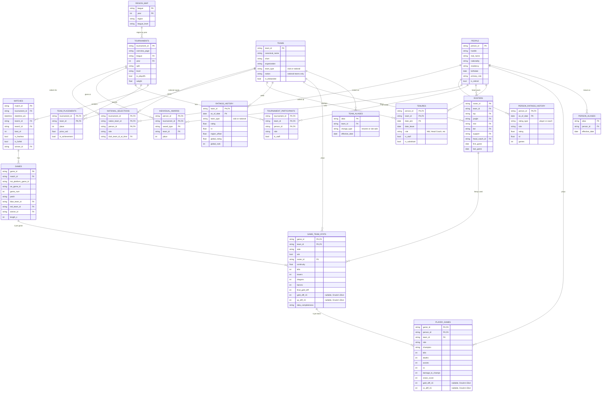

# Data model (ERD)

```mermaid
erDiagram
  REGION_MAP ||--o{ TOURNAMENTS : "region by year"
  TOURNAMENTS ||--o{ MATCHES : contains
  MATCHES ||--|{ GAMES : has
  GAMES ||--|{ GAME_TEAM_STATS : "2 per game"
  GAME_TEAM_STATS ||--|{ PLAYER_GAMES : "5 per team"
  TEAMS ||--o{ TEAM_ALIASES : "known as"
  TEAMS ||--o{ GAME_TEAM_STATS : plays
  TEAMS ||--o{ ROSTERS : fields
  ROSTERS ||--o{ GAME_TEAM_STATS : "lineup used"
  TEAMS ||--o{ RATINGS_HISTORY : rated
  PEOPLE ||--o{ PERSON_ALIASES : "known as"
  PEOPLE ||--o{ PLAYER_GAMES : plays
  PEOPLE ||--o{ TENURES : "player or coach"
  TEAMS ||--o{ TENURES : employs
  PEOPLE ||--o{ ROSTERS : "head coach"
  TOURNAMENTS ||--o{ TEAM_PLACEMENTS : awards
  TEAMS ||--o{ TEAM_PLACEMENTS : earns
  TOURNAMENTS ||--o{ TOURNAMENT_PARTICIPANTS : lists
  PEOPLE ||--o{ TOURNAMENT_PARTICIPANTS : "on roster"
  PEOPLE ||--o{ INDIVIDUAL_AWARDS : wins
  TOURNAMENTS ||--o{ INDIVIDUAL_AWARDS : "given at"
  PEOPLE ||--o{ PERSON_RATINGS_HISTORY : rated
  %% Future state: national teams
  TOURNAMENTS ||--o{ NATIONAL_SELECTIONS : "selects for"
  TEAMS ||--o{ NATIONAL_SELECTIONS : "national squad"
  PEOPLE ||--o{ NATIONAL_SELECTIONS : "called up"

  REGION_MAP {
    string league PK
    int year PK
    string region
    string league_level
  }
  TOURNAMENTS {
    string tournament_id PK
    string overview_page
    string league FK
    int year FK
    string split
    string level
    bool is_playoffs
    float weight
  }
  MATCHES {
    string match_id PK
    string tournament_id FK
    datetime datetime_utc
    string team1_id FK
    string team2_id FK
    int best_of
    bool is_fearless
    bool is_forfeit
    string winner_id FK
  }
  GAMES {
    string game_id PK
    string match_id FK
    string riot_platform_game_id
    string oe_game_id
    int game_num
    string patch
    string blue_team_id FK
    string red_team_id FK
    string winner_id FK
    int length_s
  }
  GAME_TEAM_STATS {
    string game_id PK,FK
    string team_id PK,FK
    string side
    bool win
    string roster_id FK
    float continuity
    int kills
    int towers
    int dragons
    int barons
    int final_gold_diff
    int gold_diff_15 "nullable, Oracle's Elixir"
    int xp_diff_15 "nullable, Oracle's Elixir"
    string data_completeness
  }
  PLAYER_GAMES {
    string game_id PK,FK
    string person_id PK,FK
    string team_id FK
    string role
    string champion
    int kills
    int deaths
    int assists
    int cs
    int damage_to_champs
    int vision_score
    int gold_diff_15 "nullable, Oracle's Elixir"
    int cs_diff_15 "nullable, Oracle's Elixir"
  }
  TEAMS {
    string team_id PK
    string canonical_name
    string short
    string organization
    string team_type "club or national"
    string nation "national teams only"
    bool is_disbanded
  }
  TEAM_ALIASES {
    string alias PK
    string team_id FK
    string change_type "rename or slot sale"
    date effective_date
  }
  ROSTERS {
    string roster_id PK
    string team_id FK
    string top FK
    string jungle FK
    string mid FK
    string bot FK
    string support FK
    string head_coach_id FK
    date first_game
    date last_game
  }
  PEOPLE {
    string person_id PK
    string handle
    string real_name
    string nationality
    string residency
    date birthdate
    string primary_role
    bool is_retired
  }
  PERSON_ALIASES {
    string alias PK
    string person_id FK
    date effective_date
  }
  TENURES {
    string person_id PK,FK
    string team_id PK,FK
    date date_join PK
    date date_leave
    string role "Mid, Head Coach, etc."
    bool is_staff
    bool is_substitute
  }
  TOURNAMENT_PARTICIPANTS {
    string tournament_id PK,FK
    string team_id PK,FK
    string person_id PK,FK
    string role
    bool is_staff
  }
  TEAM_PLACEMENTS {
    string tournament_id PK,FK
    string team_id PK,FK
    int place
    float prize_usd
    bool is_achievement
  }
  INDIVIDUAL_AWARDS {
    string person_id PK,FK
    string tournament_id PK,FK
    string award_type PK
    string team_id FK
    int place
  }
  RATINGS_HISTORY {
    string team_id PK,FK
    date as_of_date PK
    string team_type "club or national"
    float rating
    float rd
    float region_offset
    float global_rating
    int global_rank
  }
  PERSON_RATINGS_HISTORY {
    string person_id PK,FK
    date as_of_date PK
    string rating_type "player or coach"
    string role
    float rating
    float rd
    int games
  }
  NATIONAL_SELECTIONS {
    string tournament_id PK,FK
    string nation_team_id PK,FK
    string person_id PK,FK
    string role
    string club_team_id_at_time FK
  }
```
