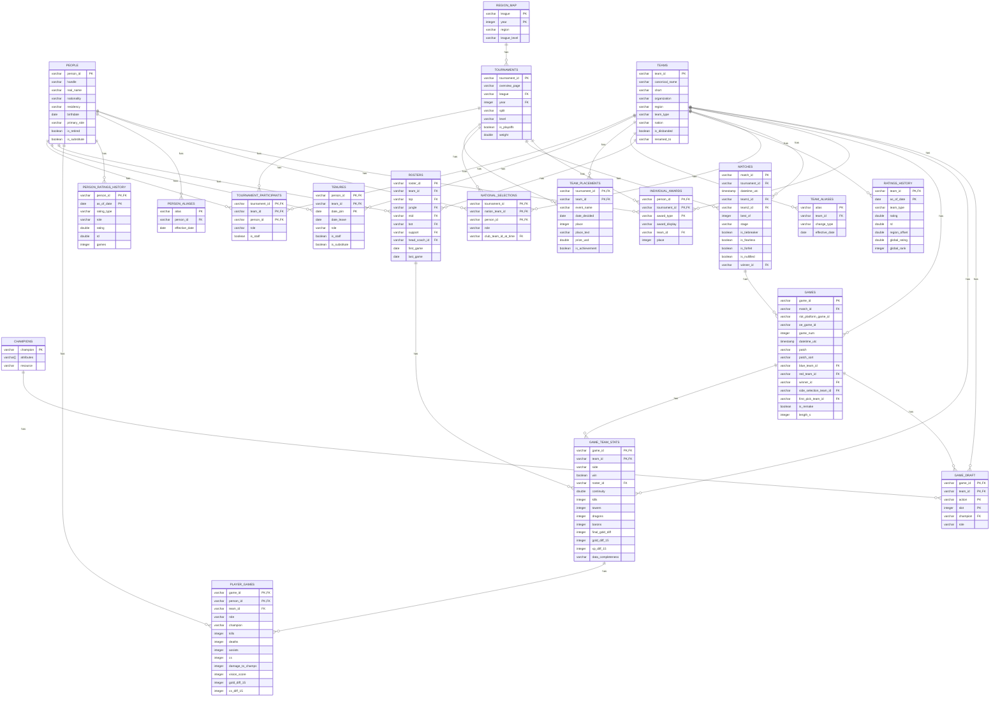

# Data model (generated from DuckDB)

```mermaid
erDiagram
  CHAMPIONS ||--o{ GAME_DRAFT : has
  GAME_TEAM_STATS ||--o{ PLAYER_GAMES : has
  GAMES ||--o{ GAME_DRAFT : has
  GAMES ||--o{ GAME_TEAM_STATS : has
  MATCHES ||--o{ GAMES : has
  PEOPLE ||--o{ INDIVIDUAL_AWARDS : has
  PEOPLE ||--o{ NATIONAL_SELECTIONS : has
  PEOPLE ||--o{ PERSON_ALIASES : has
  PEOPLE ||--o{ PERSON_RATINGS_HISTORY : has
  PEOPLE ||--o{ PLAYER_GAMES : has
  PEOPLE ||--o{ ROSTERS : has
  PEOPLE ||--o{ TENURES : has
  PEOPLE ||--o{ TOURNAMENT_PARTICIPANTS : has
  REGION_MAP ||--o{ TOURNAMENTS : has
  ROSTERS ||--o{ GAME_TEAM_STATS : has
  TEAMS ||--o{ GAME_DRAFT : has
  TEAMS ||--o{ GAME_TEAM_STATS : has
  TEAMS ||--o{ GAMES : has
  TEAMS ||--o{ INDIVIDUAL_AWARDS : has
  TEAMS ||--o{ MATCHES : has
  TEAMS ||--o{ NATIONAL_SELECTIONS : has
  TEAMS ||--o{ RATINGS_HISTORY : has
  TEAMS ||--o{ ROSTERS : has
  TEAMS ||--o{ TEAM_ALIASES : has
  TEAMS ||--o{ TEAM_PLACEMENTS : has
  TEAMS ||--o{ TENURES : has
  TEAMS ||--o{ TOURNAMENT_PARTICIPANTS : has
  TOURNAMENTS ||--o{ INDIVIDUAL_AWARDS : has
  TOURNAMENTS ||--o{ MATCHES : has
  TOURNAMENTS ||--o{ NATIONAL_SELECTIONS : has
  TOURNAMENTS ||--o{ TEAM_PLACEMENTS : has
  TOURNAMENTS ||--o{ TOURNAMENT_PARTICIPANTS : has
  CHAMPIONS {
    varchar champion PK
    varchar[] attributes
    varchar resource
  }
  GAME_DRAFT {
    varchar game_id PK,FK
    varchar team_id PK,FK
    varchar action PK
    integer slot PK
    varchar champion FK
    varchar role
  }
  GAME_TEAM_STATS {
    varchar game_id PK,FK
    varchar team_id PK,FK
    varchar side
    boolean win
    varchar roster_id FK
    double continuity
    integer kills
    integer towers
    integer dragons
    integer barons
    integer final_gold_diff
    integer gold_diff_15
    integer xp_diff_15
    varchar data_completeness
  }
  GAMES {
    varchar game_id PK
    varchar match_id FK
    varchar riot_platform_game_id
    varchar oe_game_id
    integer game_num
    timestamp datetime_utc
    varchar patch
    varchar patch_sort
    varchar blue_team_id FK
    varchar red_team_id FK
    varchar winner_id FK
    varchar side_selection_team_id FK
    varchar first_pick_team_id FK
    boolean is_remake
    integer length_s
  }
  INDIVIDUAL_AWARDS {
    varchar person_id PK,FK
    varchar tournament_id PK,FK
    varchar award_type PK
    varchar award_display
    varchar team_id FK
    integer place
  }
  MATCHES {
    varchar match_id PK
    varchar tournament_id FK
    timestamp datetime_utc
    varchar team1_id FK
    varchar team2_id FK
    integer best_of
    varchar stage
    boolean is_tiebreaker
    boolean is_fearless
    boolean is_forfeit
    boolean is_nullified
    varchar winner_id FK
  }
  NATIONAL_SELECTIONS {
    varchar tournament_id PK,FK
    varchar nation_team_id PK,FK
    varchar person_id PK,FK
    varchar role
    varchar club_team_id_at_time FK
  }
  PEOPLE {
    varchar person_id PK
    varchar handle
    varchar real_name
    varchar nationality
    varchar residency
    date birthdate
    varchar primary_role
    boolean is_retired
    boolean is_substitute
  }
  PERSON_ALIASES {
    varchar alias PK
    varchar person_id FK
    date effective_date
  }
  PERSON_RATINGS_HISTORY {
    varchar person_id PK,FK
    date as_of_date PK
    varchar rating_type
    varchar role
    double rating
    double rd
    integer games
  }
  PLAYER_GAMES {
    varchar game_id PK,FK
    varchar person_id PK,FK
    varchar team_id FK
    varchar role
    varchar champion
    integer kills
    integer deaths
    integer assists
    integer cs
    integer damage_to_champs
    integer vision_score
    integer gold_diff_15
    integer cs_diff_15
  }
  RATINGS_HISTORY {
    varchar team_id PK,FK
    date as_of_date PK
    varchar team_type
    double rating
    double rd
    double region_offset
    double global_rating
    integer global_rank
  }
  REGION_MAP {
    varchar league PK
    integer year PK
    varchar region
    varchar league_level
  }
  ROSTERS {
    varchar roster_id PK
    varchar team_id FK
    varchar top FK
    varchar jungle FK
    varchar mid FK
    varchar bot FK
    varchar support FK
    varchar head_coach_id FK
    date first_game
    date last_game
  }
  TEAM_ALIASES {
    varchar alias PK
    varchar team_id FK
    varchar change_type
    date effective_date
  }
  TEAM_PLACEMENTS {
    varchar tournament_id PK,FK
    varchar team_id PK,FK
    varchar event_name
    date date_decided
    integer place
    varchar place_text
    double prize_usd
    boolean is_achievement
  }
  TEAMS {
    varchar team_id PK
    varchar canonical_name
    varchar short
    varchar organization
    varchar region
    varchar team_type
    varchar nation
    boolean is_disbanded
    varchar renamed_to
  }
  TENURES {
    varchar person_id PK,FK
    varchar team_id PK,FK
    date date_join PK
    date date_leave
    varchar role
    boolean is_staff
    boolean is_substitute
  }
  TOURNAMENT_PARTICIPANTS {
    varchar tournament_id PK,FK
    varchar team_id PK,FK
    varchar person_id PK,FK
    varchar role
    boolean is_staff
  }
  TOURNAMENTS {
    varchar tournament_id PK
    varchar overview_page
    varchar league FK
    integer year FK
    varchar split
    varchar level
    boolean is_playoffs
    double weight
  }
```
